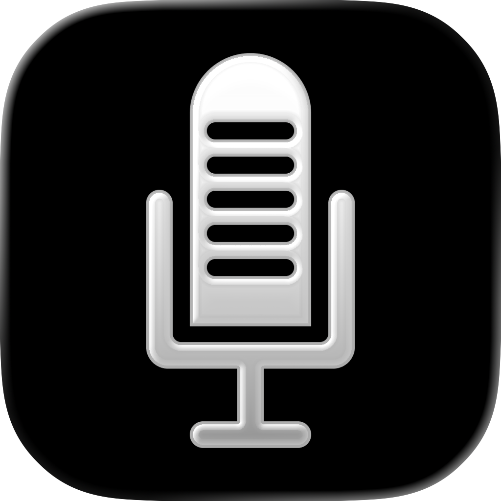

<p align="center">
  
</p>

<h1 align="center">Commandment</h1>

<p align="center">
  Open-source voice dictation for macOS. Bring your own OpenAI API key.
</p>

## How it works

- Hold a hotkey, speak, release. Your words appear wherever you're typing
- Streams audio to OpenAI in real time
- Auto-inserts text into the focused app
- API key stays in macOS Keychain — no middleman
- Default shortcuts: `Option + D` to record, `Option + Shift + D` to open Settings

## Install

Requires an [OpenAI API key](https://platform.openai.com/api-keys) and macOS

<strong><a href="https://github.com/mblode/commandment/releases/latest">Download the latest release</a></strong>, or:

```bash
brew tap mblode/tap
brew install --cask commandment
```

## Updates

- Direct-download installs can use **Check for Updates...** from the menu bar or Settings
- In-app updates are delivered through Sparkle appcasts with EdDSA signatures
- Homebrew installs can continue updating with `brew upgrade --cask commandment`

## Troubleshooting

- If Commandment is running but you can't see its menu bar icon (for example due to menu bar overflow/hidden-icon apps), press `Option + Shift + D` to open Settings directly.

## License

[MIT](LICENSE.md)
