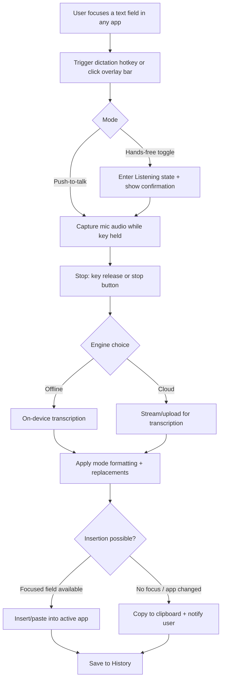

# Comparative Research: Whisper Flow, Superwhisper, and Monologue on macOS

## Executive summary

Across the current generation of “AI dictation” tools for macOS, the competitive frontier has shifted from raw speech-to-text accuracy to full workflow integration: always-available capture, low-friction insertion into any app, context-aware rewriting, and user-controlled privacy. Wispr Flow (commonly misremembered as “Whisper Flow”), Superwhisper, and Monologue all target the same core job—turn spoken thought into well-formed text in the right place—yet they differentiate through UX philosophy and processing architecture.

Wispr Flow’s product thesis is “speak naturally anywhere, and Flow writes it perfectly”, leaning into minimal interaction cost. Flow emphasises cross-app insertion, automatic clean-up (fillers, punctuation, list formatting), personal and team dictionaries/snippets, and “styles” for tone-shaping on desktop. citeturn6view0turn8view0turn6view1 Its privacy stance is nuanced: transcription “always happens in the cloud” for speed/accuracy, while “Privacy Mode” provides zero data retention (no audio, transcripts, or edits stored). citeturn7view0 The macOS UX centres on a global hotkey (documented default Fn), an on-screen “Flow bar” with clear status feedback (“ping” + moving bars), and optional hands-free modes. citeturn24view0turn24view1

Superwhisper positions itself as a power-user dictation workbench: modes, model selection (cloud and local), context capture options, a visible recording window (main + mini), and a rich History panel for reprocessing, auditing prompts, and speaker separation. citeturn9view0turn12view0turn12view2 It’s also the most explicit of the three about file transcription and operational details (menu bar “Transcribe File”, recommended media formats, storage management, deep links for automation). citeturn11view0turn13view2 Commercially, it offers subscription and lifetime licensing, with one licence covering Mac/Windows and personal iOS/iPadOS devices, but currently stores modes/vocabulary locally without cloud sync (planned). citeturn15view0

Monologue (Every) is framed as “voice dictation that writes the way you talk”, anchored in smart formatting, personal dictionary, deep context (screen), multilingual mixing, and user-configurable modes. citeturn16view2turn16view1 It leans hard on privacy messaging—no audio/transcripts saved on servers, deep context screenshots deleted immediately, and “zero LLM data retention”—while also advertising offline transcription support and local models in practice. citeturn21view3turn20view0 Its public changelog provides unusually concrete UI details (menu bar controls, reset onboarding, hotkeys like “Paste Last Transcript” and configurable cancel-recording). citeturn21view2

From a “native macOS app implementation” perspective, all three imply a common core: a menu bar agent, robust global hotkeys, low-latency audio capture, stateful transcription + post-processing, and a reliable “insert text into the active app” pipeline. The core engineering trade-off is where intelligence runs. Flow openly defaults to cloud transcription with optional zero retention; Superwhisper offers both local and cloud voice models; Monologue positions “offline transcription support” alongside privacy assurances. citeturn7view0turn15view0turn20view0 A credible PRD should therefore treat local-vs-cloud as a first-class product axis, not an implementation detail, backed by explicit user controls and clear disclosure.

## Scope, sources, and methodological notes

This report focuses on macOS functionality, features, and UI/UX of three apps: Whisper Flow (interpreted as Wispr Flow, detailed below), Superwhisper, and Monologue (Every). Sources prioritise official product sites, official documentation and changelogs, and platform listings (App Store) where available. citeturn6view0turn24view0turn9view0turn15view0turn21view2turn16view0 Reputable independent coverage is used to clarify end-user UX details and positioning when official materials are marketing-forward (notably Zapier and Cult of Mac for Wispr Flow). citeturn5view1turn5view2

Name ambiguity note: the phrase “Whisper Flow” is frequently confused with “Wispr Flow”, and the ecosystem also includes similarly named properties. Monologue’s own changelog references “WhisperFlow” as a migration source, suggesting an adjacent product exists (or existed) under that name. citeturn21view2 Meanwhile, the domain “whisperflow.app” presents a “Whisper Flow” marketing site that appears to reuse dictation positioning and testimonials similar to Wispr Flow; its provenance and relationship to Wispr Flow is unclear in public sources. citeturn1view0turn22search4 Because Wispr Flow has strong, internally consistent official documentation for macOS behaviour and system requirements, this report treats Wispr Flow as the most defensible interpretation of “Whisper Flow” for a macOS comparative analysis, while explicitly flagging conflicts where they appear.

Limitations: unless a vendor publishes a full keyboard shortcut reference, OS entitlements list, or detailed settings catalogue, some items (exact shortcut defaults, full accessibility support, all supported file formats) are reported as “not specified publicly” or inferred from release notes, with that uncertainty stated.

## App deep dives

### Whisper Flow interpreted as Wispr Flow

#### Product overview and core features

Wispr Flow describes itself as voice-to-text that turns “your thoughts into clear, polished text in any app or website”, with a focus on speaking naturally and having the system refine output as you dictate. citeturn6view0turn24view2 The official features narrative emphasises three layers: speaking anywhere (“any app”), refinement (auto punctuation, filler removal, list formatting, and backtracking corrections), and personalisation (dictionary, snippets, and “styles”). citeturn6view0turn7view1 It also explicitly targets developers with “syntax awareness” and integrations such as file tagging in Cursor/Windsurf where mentioning a filename can bring workspace context into prompts. citeturn6view0turn7view1

Wispr Flow’s privacy model is prominently featured in its dedicated Privacy & Security page. It claims it does not sell or share user data, offers a “Privacy Mode” configured via Settings → Data & Privacy → Privacy Mode that provides “zero dictation data” stored on servers, and states that transcription “always happens in the cloud” to provide speed and accuracy. citeturn7view0 The associated privacy policy (last updated 3 Feb 2026) describes optional “Context Awareness” where the product may collect limited relevant content from the active app (e.g., text on screen) to improve outputs, with opt-out controls. citeturn7view2

#### macOS UI/UX walkthrough

Wispr Flow’s official help centre provides unusually concrete “first dictation” instructions that reveal the macOS interaction design. The baseline “push-to-talk” flow is: open any app with a text field, place the caret, press-and-hold the hotkey (documented default: Fn), wait for auditory/visual confirmation (“Flow’s ping” and moving white bars), speak while holding the key, then release to paste formatted text into the focused field. citeturn24view0turn24view1 A cancellation behaviour is documented: pressing Esc during dictation cancels paste but retains the transcript in “Recent activity” within Flow. citeturn24view0

The “Flow bar” is central to the UX: it appears on screen and provides the moving white bars and stop controls, and it can also be clicked to start dictation without the hotkey. citeturn24view0turn24view1 Hands-free is a distinct mode, surfaced both via shortcut (documented default Fn+Space) and via the Flow bar. The help article describes a “Listening” confirmation screen (“Flow is now listening”) for hands-free and a stop/paste action via pressing Fn once or clicking a red stop icon in the Flow bar. citeturn24view1

Third-party walkthroughs help fill in the spatial and aesthetic details. Zapier’s review describes the recorder as an animation at the bottom of the screen, notes the default trigger as the Fn key, and observes a Preferences UI for customising the hotkey. citeturn5view1 Cult of Mac similarly reports the app runs in the background, activated by a keyboard shortcut, and highlights “Command mode” for editing (select text, switch to Command mode, speak edits). citeturn5view2turn6view1

Within the “hub” experience, Wispr Flow’s public “What’s New” entries reveal navigation patterns. A May 2025 update (“Flow Home 2.0”) states History moved to the main Home page, Home became resizable/full-screenable, settings/help moved to bottom-left, and there are customisable commands (e.g., “paste last text” shortcut customisable). citeturn8view0turn8view2 Later updates describe Desktop “Style” settings accessible via left-hand navigation and categorised by app type (personal messaging, work messaging, email, other). citeturn7view1 A June 2025 update introduces “Flow Notes” across devices, including Cmd+N inside the Flow desktop app to create a new note, and cross-platform sync between phone and desktop. citeturn8view0turn8view4

Settings and troubleshooting details in the help centre point to a traditional preferences approach with explicit Save/Close semantics: Flow advises selecting a specific microphone in Flow Settings, then clicking “Save and close”, noting “Changes do not save automatically.” citeturn24view3

Accessibility (in the user-problem sense) is positioned as a first-class use case on the public product site (“Flow for Accessibility”). citeturn6view0 However, a detailed, audited list of macOS accessibility features (VoiceOver support, full keyboard navigation, etc.) is not present in the publicly accessible sources reviewed; the focus is primarily on reducing keyboard dependency through dictation.

#### Supported file types, integrations, and workflow surface area

Wispr Flow is primarily marketed as “dictate into any app” rather than as “import and transcribe files”. Official help documentation does reference downloading an audio file from history “to verify if audio was captured” in troubleshooting scenarios, implying some internal audio artefact exists, but it does not enumerate importable media formats for transcription as a headline feature. citeturn24view2turn24view3

Integrations are described mainly as “works in any app”, with explicit examples (Notion, Gmail, Google Docs, WhatsApp, Cursor) and deeper developer workflow support (Cursor/Windsurf file tagging, variable recognition features in settings). citeturn6view0turn7view1turn8view0 Team features (shared dictionary/snippets, usage dashboards) are also explicitly positioned for organisational rollout. citeturn6view0turn6view1

#### Pricing, platform limitations, and release history

Wispr Flow lists a Free “Basic” tier and paid plans. The pricing page presents “Flow Basic” as free with weekly word limits (2,000 words/week noted for desktop; 1,000 words/week on iPhone), and “Flow Pro” as $15/user/month (or $12/user/month billed annually), with enterprise available via sales contact. citeturn6view1

System requirements for macOS are documented in Wispr Flow’s help centre: macOS 12.0+ on Apple or Intel silicon, ~500MB free storage for installation/caching, a microphone, and an internet connection. citeturn24view2 That help article also provides a platform timeline: Flow for Apple M1 Macs (Oct 2024), Intel Macs (Jan 2025), Windows (Mar 2025), iPhone (Jun 2025). citeturn24view2 The public changelog additionally states Windows launch on 12 Mar 2025. citeturn8view4

Notable discrepancy: one help article describes the default Mac hotkey as Fn, while another troubleshooting line references Cmd+Space as a Mac default hotkey; the most consistent pattern across the first-dictation and hands-free documentation (and third-party reviews) is Fn as the default. citeturn24view0turn24view2turn5view1

#### Primary user personas

Wispr Flow explicitly markets to a broad set of roles (“leaders”, “developers”, “creators”, “customer support”, “students”, “lawyers”, “accessibility”, “sales”) and frames value in terms of writing speed and quality across apps. citeturn6view0 Based on feature emphasis, the primary personas map to: (a) knowledge workers writing constantly across messaging/email/docs; (b) developers using Cursor/Windsurf and wanting syntax-aware dictation and file context; and (c) teams standardising terminology via shared dictionaries/snippets and compliance controls. citeturn6view0turn7view1turn6view1

### Superwhisper

#### Product overview and core features

Superwhisper’s documentation describes it as “ultra-fast AI powered dictation” that goes beyond transcription by applying “smart processing” to transform dictated text into outputs like emails, notes, and messages. citeturn9view0turn15view0 Its core product construct is “modes”: built-in modes (Super, Voice to Text, Message, Email, Note, Meeting) plus user-defined custom modes with personalised AI instructions, where each mode can configure voice processing, AI processing, and context capture. citeturn9view0turn11view2

Superwhisper is also explicit about model diversity and extensibility: it supports cloud and local voice models, and it allows bringing your own API keys for additional providers. citeturn9view0turn11view2 Its Pro page clarifies that local voice models and custom vocabulary, speaker separation, and AI-powered modes are Pro features. citeturn15view0

File transcription is a prominent capability: Superwhisper can transcribe external audio/video files via the menu bar, Finder, and command line, using the active mode’s settings for output formatting. citeturn11view0

#### macOS UI/UX walkthrough

Onboarding is documented as a guided flow setup: permissions, language preference, choosing an AI model (cloud or local), microphone/audio configuration, a guided first dictation using shortcuts, and verification tests. citeturn9view0 Post-onboarding, Superwhisper is primarily menu-bar driven; the docs explicitly state that you can click the menu bar icon to access settings anytime. citeturn9view0turn13view2

The menu bar icon is treated as a status and control hub. A colour-coded indicator dot communicates state: yellow (model loading), red (recording), blue (processing), green (complete). citeturn10view0turn12view0 The menu also exposes recording controls, transcribing external files, history access, settings, mode selection, input device selection, update checks, and quit. citeturn10view0turn11view0 There is an optional “Quick Recording” interaction mode that changes left-click to toggle recording and right-click to open the full menu. citeturn10view0

Superwhisper uses a dedicated recording window rather than a purely invisible agent. The “Recording Window” documentation describes a main and mini view, waveform feedback, status indicator, mode display, context capture indicators, stop/cancel controls, and behaviour differences such as a confirmation prompt when cancelling recordings longer than 30 seconds. citeturn12view0 The mini window can be configured to remain visible when idle (“always-active mini window”), used for quick mode switching/recording, and provides a right-click context menu for opening Settings/History. citeturn12view0turn12view3

Keyboard shortcuts are highly configurable and extend beyond simple start/stop. Superwhisper supports Toggle Recording, Cancel Recording, Change Mode cycling, Push-to-Talk, and even mouse button shortcuts, with support for single-modifier keys (e.g., left/right Command or Fn) as standalone triggers. citeturn13view0 Its marketing site presents ⌥+Space as a default “try it” trigger, signalling a conventional hotkey-first UX even if users can customise extensively. citeturn10view1

Settings are accessible via multiple paths: menu bar, Dock icon + ⌘, (if “Show in Dock” enabled), mini recording window context menu, and a deep link (`superwhisper://settings`). citeturn13view2turn12view3 Advanced settings include behavioural controls like disabling the recording window (audio cues only), controlling paste behaviour and “restore clipboard”, enabling “simulate keypresses”, and configuring folder location and filesync. citeturn12view3

Context awareness is explicitly defined and debugged in documentation. Superwhisper supports three context types: selected text context, application context (text from active input fields, names, and title), and clipboard context. citeturn11view5turn12view0 The docs state that Super Mode is the only built-in mode with all three context types enabled by default, with custom modes configurable. citeturn11view5

The History panel is positioned as both product feature and diagnostic tool: searching past dictations, reprocessing with new mode settings, reporting issues, deleting entries, and viewing model prompts and processing metadata; it also supports speaker separation via a Segments view and renaming speakers. citeturn12view2turn11view6

In terms of accessibility, Superwhisper’s sources focus more on operational clarity (status dots, waveform feedback, audio cues) than on explicit support for assistive technologies. It does, however, document configuration to reduce visual distractions (disable recording window, keep audio cues). citeturn12view3turn13view1

#### Supported file types, integrations, and workflow surface area

Superwhisper’s file transcription guidance recommends MP3, MP4, and mono WAV (16 kHz) for best results. citeturn11view0 Public changelog entries indicate ongoing expansion, such as adding support for additional formats (for example .ogg and .opus) and workflow refinements like a “folder watcher”. citeturn2view4

Integrations appear in three forms. First, universal “works in any app” dictation. citeturn10view1turn9view0 Second, automation and system integration via deep links (for example `superwhisper://settings`). citeturn13view2 Third, model/provider integration: Superwhisper advertises access to models from providers like OpenAI and Anthropic, and the ability to attach your own API keys. citeturn9view0turn11view2

#### Pricing, platform limitations, and release history

Superwhisper’s Pro documentation provides clear pricing and licensing: $8.49/month, $84.99/year, or $249.99 lifetime; all plans include the same features, differing only by billing frequency. citeturn15view0 A single Pro licence works across unlimited Macs and Windows PCs plus the user’s personal iPhone/iPad. citeturn15view0 It also states that modes and vocabulary are stored locally on each device and that cloud sync is planned for the future. citeturn15view0

The “Download for macOS” page specifies macOS 13.3+ for the desktop app, and positions Superwhisper as available on macOS, Windows, and iOS. citeturn2view3turn9view0 For release history, Superwhisper maintains a detailed changelog indicating frequent feature additions and model/provider updates, though the breadth of releases makes a full audit outside this report’s scope. citeturn2view4

#### Primary user personas

Superwhisper’s documentation and UX choices suggest primary personas who tolerate (or want) complexity for control: power users who switch between structured writing contexts (emails vs notes), users who need to tune models (local vs cloud), users who value auditable history and reprocessing, and professionals who transcribe meetings/lectures/interviews from files with optional speaker separation. citeturn11view2turn12view2turn11view0turn15view0

### Monologue by Every

#### Product overview and core features

Every’s launch post describes Monologue as “a voice dictation app for Mac that writes the way you talk”, emphasising understanding of vocabulary, apps, and style to work faster without breaking flow. citeturn16view2 The official feature list in that post is: smart formatting tailored to the app you’re in, a personal dictionary, deep context (screen visibility with permission), multilingual dictation across 100+ languages (including mixing), and flexible prebuilt/custom modes. citeturn16view2turn16view1

Monologue’s site reiterates “works in every app” and presents a “notes feature to record and transcribe meetings and notes to self.” citeturn16view1turn21view2 The site also claims the iOS app syncs with the desktop app, sharing dictionary, modes, and preferences. citeturn16view1turn21view2

#### macOS UI/UX walkthrough

Monologue’s best public UX artefacts are its website (images + positioning) and its official public changelog, which contains operational UI details.

A key UX promise is universal availability. The website says “Monologue’s keyboard works in every app” and instructs users to “click the 􀆪 to use it,” implying a persistent control surface (likely a menu bar or overlay affordance) rather than app-bound input only. citeturn16view1 The changelog confirms it is a menu bar app and provides a specific onboarding reset path: “Menu bar app > [three dots] > Reset onboarding.” citeturn21view2 The “Monologue is live” entry also describes redesigned onboarding with “smarter model selection” and clearer tutorials. citeturn21view2

Mode and dictation engine UX is surfaced in release notes. A November 2025 entry describes a “new dictation engine hiding in the sidebar toggle” as a Faster Dictation beta, with the reassuring behaviour that “every recording is still saved under the hood” so users can re-run from “Transcripts” (suggesting a core IA with a Transcripts/history area). citeturn21view2 Another entry states that dictations can be re-run from transcripts to avoid losing a dictation. citeturn21view2

Keyboard shortcuts are treated as configurable primitives. Early release notes specify a “Paste Last Transcript shortcut” configurable in Settings → General, and a “Cancel Recording hotkey” configurable in Settings → General with default Escape. citeturn21view2 A later release also adds more robust paste behaviour when switching apps mid-dictation (clipboard fallback rather than pasting into the wrong app), and improved behaviour when there is no focused text field on stop (intelligently copy to clipboard). citeturn21view2 These notes reveal a major UX risk area (cross-app insertion) and Monologue’s explicit mitigation strategy (predictable clipboard fallback). citeturn21view2

Settings IA emerges from changelog entries: Mic & Audio settings panel with live mic meter and clearer selector (v1.0.54), model downloads in Settings → General for local transcription (v1.0.50), Privacy settings in Settings → Data & Privacy (screen capture permission handling fixes; delete all transcripts), and system settings like media interruption behaviour. citeturn21view2

On accessibility, Monologue’s iOS App Store listing explicitly states the developer has not yet indicated which accessibility features the app supports (for iOS). citeturn16view0 For Mac, public sources emphasise speed and privacy rather than explicit VoiceOver/Voice Control support statements.

#### Supported file types, integrations, and workflow surface area

Monologue is positioned around dictation into any app and native note recording/transcription rather than general “file transcription”. Its official public materials reviewed here do not list supported import formats (e.g., MP3/MP4/WAV) the way Superwhisper does; instead, it talks about “notes” to transcribe meetings/monologues, implying in-app capture. citeturn16view1turn21view2

Integrations, as evidenced by changelog, are primarily: sign-in providers (Google; Every account), browser/app detection improvements (e.g., Comet browser, ChatGPT Atlas browser), and IDE paste fixes (Zed, WezTerm, Sublime Text). citeturn21view2 The changelog also explicitly mentions dictionary import from competitors (SuperWhisper, Aqua Voice, WhisperFlow) as a one-click migration feature. citeturn21view2

#### Pricing, platform limitations, and release history

Every’s launch post states Monologue is available as part of a paid Every subscription and also as a standalone with early-bird pricing, plus a free trial up to 1,000 words. citeturn16view2turn17view0 The Every subscription page shows $30/month (monthly) or $288/year ($24/month) with a free trial. citeturn17view0 Monologue’s own site presents “early bird pricing” for Monologue Pro (shown as $100/year) and a Free trial tier with 1,000 words included; it also claims “offline transcription support.” citeturn20view0turn16view1

The iOS App Store listing (published as of Feb 2026) shows in-app purchases for “Monthly Pro Access (Early Bird) $9.99” and “Yearly Pro Access (Early Bird) $99.99” and indicates version 1.0/1.0.1 released “2d ago” (relative to App Store page crawl time). citeturn16view0 (Note: this is the iOS client listing, not a Mac App Store listing.)

Monologue’s official product changelog provides a strong release history anchor: public launch on Sep 16, 2025; multiple macOS releases through late 2025; and an iOS release announcement on Feb 17, 2026 with cross-device sync and unified accounts. citeturn21view2turn16view0

Platform limitations are partly implicit. The changelog references “screen capture permission handling” and privacy settings work, indicating deep-context features depend on macOS screen access permissions. citeturn21view2turn16view2 The public sources reviewed do not clearly state minimum macOS version requirements; one release note references fixes for “text rendering issues on macOS 26,” suggesting active maintenance for that OS generation. citeturn21view2

#### Primary user personas

Monologue’s own marketing examples and Every’s launch post target users who write frequently across contexts (support, product, design, educators, engineers, executives) and multilingual users who mix languages fluidly. citeturn16view1turn16view2 The “deep context” emphasis suggests a persona who wants the system to reference what’s currently on-screen (e.g., drafting responses based on visible material), while the privacy/offline messaging suggests privacy-sensitive users who still want AI formatting. citeturn16view2turn21view3turn20view0

## Comparative analysis

### Feature and capability matrix

The table below focuses on the macOS experience (or cross-platform features that materially affect macOS usage).

| Dimension | Whisper Flow (Wispr Flow) | Superwhisper | Monologue (Every) |
|---|---|---|---|
| Primary workflow | Dictate into any app; AI cleans up as you speak citeturn6view0turn24view0 | Dictate into any app; mode-based post-processing + strong audit trail citeturn9view0turn11view2turn12view2 | Dictate into any app; “writes the way you talk” via formatting + deep context citeturn16view2turn16view1 |
| Start/stop interaction | Press-and-hold hotkey (documented default Fn); Flow bar click-to-start citeturn24view0turn24view1 | Hotkey-triggered recording window; menu bar start/stop; configurable toggle/push-to-talk citeturn13view0turn10view0turn12view0 | Menu bar/overlay implied; configurable hotkeys (e.g., cancel recording default Esc; paste last transcript) citeturn21view2turn16view1 |
| Hands-free mode | Yes (Fn+Space default; “Listening” screen; stop/paste) citeturn24view1 | Yes, via toggle recording and push-to-talk paradigms; mini window can be always visible citeturn13view0turn12view0turn12view3 | Not explicitly branded “hands-free” in sources, but notes + recording engine implies long-form recording support citeturn21view2turn16view1 |
| UI surface | Flow bar on screen; separate “Home” hub with history, styles, etc. citeturn24view0turn8view0turn7view1 | Menu bar icon + recording window (main/mini) + settings + history panel citeturn10view0turn12view0turn12view2 | Menu bar app + dashboard/transcripts inferred from changelog; website implies “keyboard” affordance citeturn21view2turn16view1 |
| Modes/templates | Command mode + Styles (tone presets by app category) citeturn6view1turn7view1 | Extensive built-in + custom modes; per-mode model & context settings citeturn11view2turn15view0 | Prebuilt workflows + custom modes; mode switching appears in UI/changelog citeturn16view2turn21view2 |
| Context awareness | Optional “Context Awareness” collecting limited app content (per privacy policy) citeturn7view2turn6view0 | Three context types (selected text, application context, clipboard); Super mode enables all by default citeturn11view5turn12view0 | “Deep context” by screen access permission; privacy page says screenshots deleted immediately citeturn16view2turn21view3turn21view2 |
| Vocabulary tools | Personal dictionary + snippets; team shared dictionary/snippets on Pro/Enterprise citeturn6view0turn6view1 | Vocabulary words + deterministic replacements citeturn12view1 | Personal dictionary + word replacements (changelog); import dictionary from competitors citeturn21view2turn16view2 |
| File transcription import | Not a headline feature; internal audio can be downloaded from history for troubleshooting citeturn24view3 | Yes (audio/video file transcription); recommended MP3/MP4/mono WAV 16 kHz citeturn11view0turn10view0 | Not specified as a file-import product feature; in-app notes recording is highlighted citeturn16view1turn21view2 |
| Local/offline operation | Cloud transcription stated as always on; internet required; “Privacy Mode” is retention control citeturn7view0turn24view2 | Cloud + local voice models (Pro includes local) citeturn11view2turn15view0 | Claims offline transcription support; changelog references local models citeturn20view0turn21view2 |
| Cross-device sync | Notes and features sync across Mac/iPhone; team features for Pro; Enterprise SSO etc citeturn8view0turn6view1 | Licence works across platforms; content syncing not yet (modes/vocab local) citeturn15view0 | iOS app announced with sync of dictionary/modes/preferences from Mac citeturn21view2turn16view1 |
| Pricing posture | Freemium with word caps; Pro per user per month; Enterprise with compliance/SSO citeturn6view1turn7view0 | Paid Pro with monthly/annual/lifetime; limited free/trial capabilities citeturn15view0turn9view0 | Included in Every subscription ($30/mo) + standalone early bird; free tier with 1,000 words citeturn16view2turn17view0turn20view0 |

### UX patterns, strengths, and weaknesses

Wispr Flow’s dominant UX pattern is “minimum chrome, maximum immediacy”: press a single key, get a visual + audio confirmation, speak, release to paste. citeturn24view0turn5view1 This design strongly optimises time-to-text and muscle memory, while shifting more complexity into a central hub (history, style, dictionary/snippets, billing). citeturn8view0turn7view1turn6view1 Its primary weakness (for some buyers) is architectural: cloud transcription is stated as always on, with privacy mode controlling retention rather than eliminating cloud processing. citeturn7view0turn24view2

Superwhisper’s UX pattern is “observable and configurable”. The recording window, status dot, waveform, mode indicators, and history/prompt inspection are designed to reduce ambiguity about what happened and why. citeturn12view0turn12view2turn10view0 This is a strength for professional and privacy-sensitive workflows (especially when combined with local models), but may feel heavy for users who just want “press one key, get text.” citeturn15view0turn9view0 It is also candid about current sync limitations (modes/vocabulary local per device), which can be a weakness for users expecting seamless device parity. citeturn15view0

Monologue’s UX pattern is “contextual writing assistant” more than “dictation utility”. Deep context, mode flexibility, and consistent formatting for the app you are in are the core value claims. citeturn16view2turn16view1 Its strengths are privacy-forward messaging (including screenshot deletion for deep context) and a changelog that shows steady iteration on the hardest UX edge cases (paste correctness across app switching; clipboard fallback). citeturn21view3turn21view2 Its weaknesses are the relative newness of the product surface (bugs and stability work are frequent changelog themes) and less publicly specified macOS-level detail (system requirements, explicit shortcut defaults beyond a handful, explicit accessibility support statements). citeturn21view2turn16view0

## Competitive landscape and differentiators

A useful way to understand differentiation is to separate “dictation accuracy” from “interaction correctness”. All three compete on getting words right; the more meaningful differences are (a) how reliably the text lands in the right place, (b) how much the system adapts to context and style without user micromanagement, and (c) what privacy guarantees are concrete and verifiable.

Wispr Flow differentiates through enterprise-grade security positioning and team features, plus developer-centric enhancements like syntax awareness and file tagging workflows in Cursor/Windsurf. citeturn6view0turn6view1turn7view1 Its public “Privacy & Security” page explicitly asserts compliance markers (SOC 2 Type II, ISO 27001, HIPAA) and offers enforced privacy mode for enterprise accounts. citeturn7view0turn6view1 Crucially, it also makes a deliberate architectural bet: cloud transcription for speed/accuracy, with user choice for retention. citeturn7view0

Superwhisper’s differentiator is breadth and controllability: mode system as a product primitive, multi-provider model strategy (including BYO keys), explicit context capture types, and a deep history/audit experience (including visible prompts and speaker separation). citeturn11view2turn11view5turn12view2turn15view0 From a competitive standpoint, file transcription is a major “adjacent job” expansion that neither Wispr Flow nor Monologue foreground as strongly. citeturn11view0

Monologue differentiates on “intent capture” with deep context and “writing voice”, plus privacy positioning that includes immediate deletion of deep-context screenshots and “zero LLM data retention.” citeturn16view2turn21view3 It also leverages distribution bundling as a strategic channel: inclusion in Every’s paid subscription alongside other AI apps. citeturn16view2turn17view0 Finally, Monologue’s explicit competitor-migration work (dictionary import) is a tactical differentiator for switching costs. citeturn21view2

## Native macOS implementation considerations

A native macOS app in this category is fundamentally an “agent + UI shell” architecture: always-on capture and insertion, plus optional hub screens for settings/history. The product-level decisions (privacy, offline, and context capture) directly constrain technical design.

### System architecture patterns

A robust baseline separates the product into five independent subsystems:

Audio capture pipeline should be built on Apple’s audio frameworks. AVFoundation is Apple’s framework for working with audiovisual media, including capture and processing, and its capture subsystem provides a high-level architecture for audio capture on macOS. citeturn22search2turn22search6 For low-latency microphone streaming in a dictation app, AVAudioEngine is a common building block (an “audio engine object” that manages a graph of audio nodes for real-time rendering). citeturn22search10

Speech-to-text engine can be implemented using Apple Speech framework or custom ML. Apple’s Speech framework supports speech recognition on live or pre-recorded audio and returns transcriptions and alternative interpretations. citeturn22search5turn22search9 Apps must request speech recognition authorisation before use and include required usage-description keys; Apple explicitly notes missing the key can cause a crash when requesting authorisation. citeturn22search13 If you want to enforce “no network” for Apple Speech recognition requests, Apple provides a `requiresOnDeviceRecognition` flag that “prevent[s] … sending audio over the network,” noting on-device requests may be less accurate. citeturn22search17 For custom on-device transcription (e.g., Whisper-class models), Core ML provides on-device model execution, stating Core ML APIs enable predictions “all on a person’s device.” citeturn23search0turn23search4

Post-processing layer (formatting, mode prompts, tone) should be architected independently of transcription. All three competitors treat post-processing as a first-class product feature (“Flow edits while you speak,” “smart processing,” “smart formatting”), which implies deterministic formatting, vocabulary replacement, and optional LLM-based rewriting. citeturn6view0turn9view0turn16view2 This layer should be able to run with: (a) no network (deterministic rules + local models), or (b) cloud LLM, depending on user privacy choices.

Insertion and accessibility is the true “hard part” on macOS. Inserting text into arbitrary third-party app fields typically requires a combination of focus detection and system-level interaction. Apple’s ApplicationServices provides AXUIElement, an accessibility object representing UI elements and their actions in the accessibility hierarchy. citeturn22search11turn22search23 Superwhisper and Monologue’s release notes indirectly show how much product engineering goes into paste correctness (clipboard restore, simulate keypresses, app-switch safe paste semantics). citeturn12view3turn21view2 A production solution should have layered fallbacks: direct AX value set when possible, pasteboard-based insertion, and explicit clipboard restoration.

State, history, and sync needs a local persistence layer plus optional cloud sync. If you choose Apple’s ecosystem approach, CloudKit provides interfaces for moving data between the app and iCloud containers to support multi-device access. citeturn23search3 CloudKit also provides privacy-preserving and encryption mechanisms to protect user data in transit and at rest on iCloud servers. citeturn23search43 Competitor patterns show why sync matters: Flow syncs Notes and (for teams) shared dictionaries; Superwhisper explicitly does not yet sync modes/vocab; Monologue announces syncing dictionary/modes/preferences to iOS. citeturn8view0turn15view0turn21view2

### UI frameworks and macOS UX conventions

For a native macOS app, SwiftUI offers a declarative UI framework with views/controls/layout and event handlers for user input. citeturn23search1 AppKit remains the foundational macOS UI framework, and Apple notes it includes built-in support for localisation and accessibility and can interoperate with SwiftUI. citeturn23search2turn23search22 A practical architecture commonly uses SwiftUI for the hub/settings/history screens while relying on AppKit for menu bar status items, global hotkeys, and low-level window behaviours (floating panels, non-activating overlays).

Accessibility should be treated as a first-class requirement, not an afterthought. Apple provides Accessibility APIs and guidance for integrating accessibility into an app (including using appropriate accessibility properties and protocols). citeturn22search3turn22search19turn22search31 If distributing on the App Store, Apple also supports “accessibility declarations” metadata management to show accessibility details on the App Store page. citeturn22search7

### Offline vs cloud processing model

Competitors demonstrate three distinct strategies:

Cloud-first with retention controls (Wispr Flow): transcription always in cloud, with Privacy Mode controlling whether dictated data is stored/training-used. citeturn7view0turn7view2

Hybrid models (Superwhisper): cloud and local voice models; local models are a Pro feature. citeturn15view0turn11view2

Offline-first messaging with selective cloud acceleration (Monologue): claims “offline transcription support” and “local transcription,” while also shipping WebSocket/streaming throughput improvements and an opt-in to share transcriptions for quality. citeturn20view0turn21view2

A modern PRD should treat this as a product surface with explicit choices: “offline only”, “cloud (zero retention)”, and “cloud (improve product via opt-in sharing)”, each with visible implications for latency, accuracy, cost, and privacy.

## Product requirements document for a native macOS app

This PRD defines a native macOS dictation product inspired by the strongest patterns across Wispr Flow, Superwhisper, and Monologue, while aiming to reduce their key pain points (unclear insertion correctness, sync gaps, and privacy ambiguity). It is written as if building a new product from scratch.

### Product vision and goals

Working title: **Voicebar** (native macOS dictation agent).

Vision: enable users to “speak into any text field” and receive polished, correctly formatted text with minimal friction, while offering transparent privacy controls and strong reliability under real-world app switching.

Product goals:

Deliver a sub-second-feeling dictation loop for short messages (chat/email) with clear feedback and high paste correctness (borrowing Wispr Flow’s minimal hotkey + bar UX and Superwhisper’s status signalling). citeturn24view0turn12view0turn10view0

Provide mode-based transformation that is powerful but not intimidating: start with a few high-quality defaults (Message, Email, Note, Code), plus an approachable custom-mode editor (inspired by Superwhisper and Monologue). citeturn11view2turn16view2

Make privacy a product feature: users can choose offline-only transcription (Core ML) or cloud transcription with explicit “zero retention” controls (aligning with competitors’ privacy claims but making trade-offs explicit). citeturn23search4turn7view0turn21view3

Non-goals for initial release:

Full meeting assistant suite (calendar join, diarisation at scale, summarisation workflows). Superwhisper already covers some meeting needs; Monologue notes focus on capture rather than enterprise meeting workflows. citeturn11view0turn16view1

Team/enterprise controls (SSO, dashboards) in MVP. These can be planned as Phase 2 (Flow’s enterprise path is proof of demand). citeturn6view1turn7view0

### Success metrics

Activation:

Time-to-first-success: % of installs that complete onboarding and successfully paste a dictation into a third-party app within 5 minutes.

First-week retention: % of users who perform ≥10 dictations in week 1 and return in week 2.

Reliability and UX correctness:

Paste success rate: % of dictations that end with intended insertion (or explicit clipboard fallback) without user confusion. Monologue’s changelog shows paste misrouting is a major failure mode worth measuring explicitly. citeturn21view2

Cancellation safety: rate of “accidental cancel” events; Superwhisper’s >30s cancel-confirm pattern suggests this is important for longer dictations. citeturn12view0

Performance:

End-to-text latency distribution (p50, p95) split by engine choice (offline vs cloud) and by dictation length.

Quality:

User edits after paste (proxy via optional “quick fix” actions or user-reported corrections), and vocabulary replacement hit rate (to measure dictionary value). citeturn12view1turn6view0turn21view2

### Personas and core jobs-to-be-done

Primary personas:

Fast communicator: lives in Slack/Teams/iMessage/email; wants quick, polished messages without switching contexts. citeturn24view0turn16view2

Builder/developer: dictates into Cursor/terminals/docs; needs syntax-aware output and accurate proper nouns/variables. citeturn6view0turn7view1turn16view1

Writer/creator: drafts longer content; wants tone consistency and minimal cleanup. citeturn6view0turn7view1turn9view0

Multilingual user: mixes languages mid-sentence and expects correct handling. citeturn6view0turn16view2turn16view1

Privacy-sensitive professional: requires explicit data handling controls; may need offline-only mode. citeturn7view0turn21view3turn23search4

### Functional requirements

Core dictation (MVP):

Global hotkey dictation with two modes: push-to-talk (press-and-hold) and hands-free toggle. The Flow pattern (Fn press-and-hold; Fn+Space hands-free; “Listening” confirmation UI) demonstrates a low-friction path. citeturn24view0turn24view1

Visual/auditory feedback: always show state transitions (recording, processing, complete) via a small overlay bar and optional sound cues; Superwhisper’s colour-dot state system is a strong, learnable example. citeturn10view0turn13view1

Cancel behaviour: Esc cancels paste but preserves transcript in History (Flow demonstrates this user-safe behaviour). citeturn24view0

Insertion correctness: if focus is lost or app changes mid-dictation, fall back to clipboard-with-notification rather than “paste into wrong app” (explicitly learned from Monologue’s paste fixes). citeturn21view2

Modes:

Ship default modes: Voice-to-text (minimal formatting), Message, Email, Note, Code.

Mode switching should be fast and keyboard-first (cycle shortcut), matching Superwhisper’s “hold modifiers and tap to cycle” approach. citeturn11view3turn13view0

Custom modes: allow users to define transformation instructions (e.g., “write concise Australian English; no emojis; bullet lists only if asked”), similar to Superwhisper and Monologue’s “design your own” positioning. citeturn11view2turn16view2

Context awareness:

Context sources: selected text, clipboard, and limited application context (title/field text) with explicit UI indicator when captured (Superwhisper’s model is clear and debuggable). citeturn11view5turn12view0

Optional screen context (deep context) gated behind explicit permission and strict retention policy, mirroring Monologue’s marketing and privacy page. citeturn16view2turn21view3turn21view2

Vocabulary and personalisation:

Vocabulary list for recognition hints + deterministic replacements (Superwhisper) and “learn by correction” behaviour (Wispr Flow dictionary). citeturn12view1turn6view0

Snippets: speak a cue and insert longer prepared text (Flow’s “snippets” positioning). citeturn6view0

History:

A History panel that stores: audio reference (optional), raw transcript, final output, mode used, engine used, and any context metadata. Superwhisper’s History panel is a strong pattern (search, reprocess, copy, report issue). citeturn12view2turn11view6

Reprocess: users can re-run an existing recording through a different mode/engine. citeturn11view6turn21view2

Engine choices:

Offline engine: on-device transcription model using Core ML where feasible, aligning with Core ML’s on-device execution and privacy benefit. citeturn23search4turn23search0

Cloud engine: streaming transcription endpoint for low latency; offer a “zero retention” option consistent with the competitive baseline. citeturn7view0turn21view3

### UX flows and annotated mockup descriptions

Overall IA: menu bar agent + hub window.

Menu bar dropdown (inspired by Superwhisper’s menu bar options and status dot):

Top row: app name + status dot (Idle / Recording / Processing / Error). citeturn10view0  
Primary actions: Start/Stop dictation; Start hands-free; Change Mode (submenu); New Note; Open Hub; Settings; History; Quit. citeturn10view0turn8view0

Overlay bar (inspired by Flow bar + Superwhisper recording/miniview):

Idle: slim horizontal bar centred near bottom, subtle indicator.  
Recording: waveform/moving bars + red stop button; shows active mode. citeturn24view1turn12view0  
Processing: spinner + “Processing…” with progress if streaming.  
Complete: brief “Pasted” toast; if clipboard fallback used, show “Copied to clipboard (no focused field)” (Monologue pattern). citeturn21view2turn24view0

Onboarding flow (first launch):

Welcome screen: short pitch + “Start free” CTA + choice of engine default (Cloud fast / Offline private / Ask me later). Use plain-language explanations referencing trade-offs; competitors already expose these differences implicitly. citeturn7view0turn15view0turn20view0  
Permissions screen: microphone (required), optional screen context permission (optional), and accessibility/paste assistance (required for cross-app insertion). Surface why each is needed, and allow “Skip for now” where possible.  
Hotkey setup: detect conflicts, suggest a safe default, provide test field. Superwhisper shows value in configurable shortcuts, including single modifier keys. citeturn13view0turn24view0  
First dictation tutorial: open TextEdit-like sandbox inside app or guide user to click into a field, then dictate; show “ping + moving bars” concept explicitly (Flow). citeturn24view0turn24view1

Hub window sections (SwiftUI tab layout; AppKit interop as needed):

Home: stats (words dictated, streak), quick actions (New Note, Recent dictations), and “Mode quick picker”. Flow Home 2.0 indicates users value History on Home and resizable/full-screen hub. citeturn8view0turn8view2  
History/Transcripts: left sidebar list + detail view with “Raw” vs “Processed” toggle and Copy, Reprocess, Delete. Superwhisper’s “Voice vs AI” toggles and prompt visibility are useful patterns. citeturn12view2turn11view6  
Modes: list of modes with per-mode engine selection, context toggles, and formatting rules.  
Dictionary & Replacements: two tabs; allow import from text file (CSV) and manual entry; deterministic replacement editor (similar to Superwhisper). citeturn12view1turn21view2  
Snippets: cue → expansion editor with formatting preview (Flow pattern). citeturn6view0  
Settings: microphone selection, sound cues, hotkeys, privacy and retention, and update channel.

Mermaid flowchart for main user flow:

### Accessibility requirements

Minimum accessibility bar:

Full keyboard navigation across all hub screens and dialogs; ensure all controls have accessible labels and values. Apple’s guidance emphasises using accessibility modifiers/labels in SwiftUI to improve experience, and testing with VoiceOver, Voice Control, Switch Control, etc. citeturn22search31turn22search15

VoiceOver support for menu bar items and overlay control; overlay must be reachable via keyboard shortcut even if not easily discoverable by pointer.

Respect system settings such as reduced motion and reduce transparency (implementation standard practice; not vendor-documented here).

If distributed via App Store, prepare an accessibility declaration (so the App Store page can show supported accessibility features). citeturn22search7

### Analytics and event instrumentation

Event taxonomy should explicitly measure the hardest failure modes competitors are visibly working on:

Dictation lifecycle: `dictation_started`, `dictation_audio_captured_ms`, `dictation_stopped`, `transcription_started`, `transcription_completed`, `postprocess_completed`.

Insertion: `paste_attempted`, `paste_succeeded`, `clipboard_fallback_used` (Monologue’s changelog implies clipboard fallback is an intentional UX contract). citeturn21view2

Errors: `mic_permission_denied`, `accessibility_permission_denied`, `engine_error_offline_model_missing`, `engine_error_network`, `hotkey_conflict_detected`.

Configuration: `mode_changed`, `mode_custom_created`, `dictionary_added`, `replacement_added`, `snippet_created`.

Privacy flags: `privacy_mode_enabled`, `screen_context_enabled`, `data_sharing_opt_in` (Monologue’s changelog and Flow’s privacy mode both indicate explicit toggles matter). citeturn7view0turn21view2

### Security and privacy requirements

Privacy tiers (explicit user choice):

Offline-only: all transcription and post-processing on device (Core ML-based where feasible). Core ML explicitly supports on-device execution, avoiding network dependency. citeturn23search4turn23search0

Cloud, zero retention: send audio for transcription but do not store; mirror Wispr Flow’s “Privacy Mode” contract and Monologue’s “no audio/transcripts saved” contract; publish an auditable statement in-app. citeturn7view0turn21view3

Cloud, opt-in improvement: allow users to share transcripts/corrections for quality improvements (similar to Monologue’s optional opt-in). citeturn21view2

Data controls:

Provide “delete all transcripts” and per-item deletion (Monologue and Superwhisper both emphasise control over history). citeturn21view2turn12view2

If implementing iCloud sync, use CloudKit private database for user data; CloudKit is explicitly designed to move data between app and iCloud containers. citeturn23search3 Consider CloudKit encryption guarantees for user trust. citeturn23search43

### Deployment plan, milestones, and estimated effort

Release strategy:

Internal alpha (2–4 weeks): focus on capture + insertion correctness in a small set of apps (TextEdit, Slack, Chrome, Mail).

Closed beta (6–8 weeks): add modes, history, privacy tiers; measure paste correctness; ship fast iteration loop similar to competitors’ changelogs. citeturn21view2turn2view4turn7view1

Public launch: with a clear changelog and in-app disclosure of engine behaviour and retention.

Milestones (illustrative):

| Phase | Duration | Deliverables |
|---|---:|---|
| Foundations | 3 weeks | Menu bar agent; global hotkeys; audio capture via AVAudioEngine; overlay bar UI; basic paste/clipboard fallback citeturn22search10turn22search23turn21view2 |
| MVP dictation | 4 weeks | Cloud transcription engine + offline baseline; basic modes (Message/Email/Note/Code); history list + copy; core settings citeturn22search5turn23search0turn11view2turn12view2 |
| Personalisation | 3 weeks | Dictionary + replacements + snippets; mode editor; context capture (selected text + clipboard); analytics instrumentation citeturn12view1turn6view0turn11view5 |
| Launch hardening | 2 weeks | Performance tuning; reliability; accessibility pass; localisation scaffolding; installer/notarisation; support docs citeturn23search2turn22search19turn22search31 |

Estimated roles (MVP through launch hardening):

Product manager (0.5–1 FTE): PRD ownership, prioritisation, beta feedback loop.

Product designer (1 FTE for ~6–8 weeks): onboarding, overlay/hub IA, mode editor ergonomics, accessibility review (informed by Apple guidance). citeturn22search31turn22search19

macOS engineer (2 FTE for ~10–12 weeks): menu bar agent, hotkeys, AppKit/SwiftUI interop, insertion pipeline, history store, auto-update (implementation detail).

ML/Applied engineer (1 FTE for ~8–10 weeks): STT engine integration (Core ML model packaging, streaming protocols), post-processing, evaluation harness. Core ML’s on-device orientation underpins this work. citeturn23search0turn23search4

QA/Automation (0.5–1 FTE ongoing): app-compatibility matrix testing (Slack, Teams, Chrome, Safari, Cursor), performance and regression.

Support/ops (part-time): docs and ticket triage; competitors demonstrate ongoing iteration is essential. citeturn22search16turn21view2turn2view4

### Recommended reference screens for implementation

Wispr Flow help centre screens and concepts to reference during design reviews: “Flow bar”, “Listening confirmation screen”, and the documented hands-free stopping/paste interactions. citeturn24view1turn24view0

Superwhisper’s interface docs: menu bar status dot states, recording window main/mini design, and History panel structure (including voice vs AI views and prompt visibility). citeturn10view0turn12view0turn12view2

Monologue’s changelog-driven UX learnings: reset onboarding path; paste correctness and clipboard fallback; model download UX; privacy settings including screen permission handling. citeturn21view2turn21view3